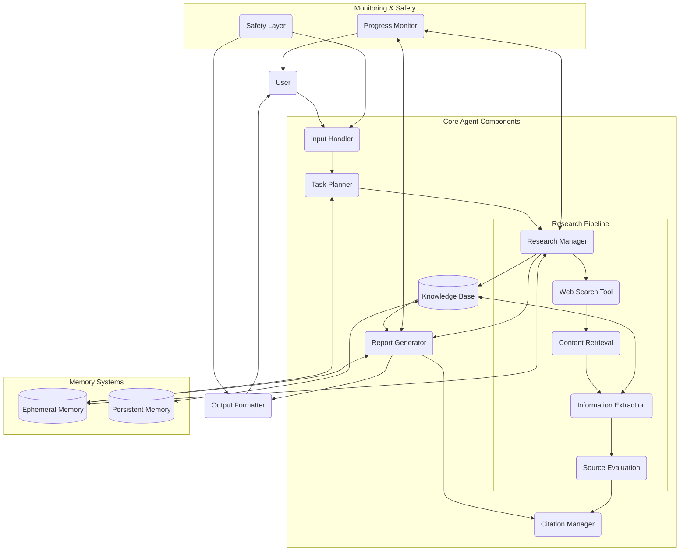

# System Patterns: Web Research Assistant & Report Writer

## System Architecture

The Research Assistant follows a modular architecture with distinct components organized in a pipeline pattern:

## Key Design Patterns

### 1. Pipeline Architecture
The system uses a pipeline architecture for the core research flow, allowing each component to focus on a specific task and pass its outputs to the next component. This enables:
- Clear separation of concerns
- Parallel processing where possible
- Easy monitoring of individual stages
- Ability to retry/recover specific stages upon failure

### 2. Manager-Worker Pattern
The Research Manager acts as a coordinator that delegates specific tasks to specialized workers (search, content retrieval, extraction, etc.). This pattern:
- Centralizes orchestration logic
- Enables efficient resource allocation
- Facilitates progress tracking
- Provides a single point for error handling

### 3. Repository Pattern
The Knowledge Base implements a repository pattern to abstract storage details from the application logic:
- Provides a consistent interface to different data sources
- Handles data persistence concerns
- Manages data relationships and integrity
- Offers query capabilities for different use cases

### 4. Memory Systems
The system employs dual memory systems:
- **Ephemeral Memory**: Short-term storage for the current research task
- **Persistent Memory**: Long-term storage for knowledge that can be reused

This approach:
- Optimizes for both speed (ephemeral) and persistence
- Allows for context retention across multiple operations
- Enables learning from past research tasks

### 5. Observer Pattern
The Progress Monitor implements an observer pattern to track and report on the system's activities:
- Monitors state changes across components
- Calculates progress metrics
- Generates user-facing updates
- Records performance metrics for later analysis

### 6. Safety Layer
The Safety Layer acts as a cross-cutting concern that enforces guardrails across the system:
- Content filtering and safety checks
- Bias detection and mitigation
- Source credibility verification
- PII detection and redaction

## Component Relationships

### Input Processing Flow
1. User submits research request
2. Input Handler processes and validates the request
3. Task Planner creates a structured research plan
4. Research Manager breaks down plan into executable tasks

### Research Execution Flow
1. Research Manager dispatches search queries
2. Web Search Tool retrieves search results
3. Content Retrieval extracts content from promising sources
4. Information Extraction identifies relevant facts and insights
5. Source Evaluation assesses credibility and relevance
6. Knowledge Base stores structured findings

### Report Generation Flow
1. Research Manager determines research completion
2. Report Generator synthesizes findings from Knowledge Base
3. Citation Manager formats and integrates source citations
4. Output Formatter creates final document in requested format
5. System delivers report to user and collects feedback

## Key Technical Decisions

### 1. LLM Selection and Configuration
- Primary Model: GPT-4o
  - Strengths: Strong reasoning, excellent knowledge, sophisticated tool use
  - Configuration: Lower temperature (0.2) for factual outputs
- Specialized Models for Specific Tasks:
  - Search Query Generation: GPT-3.5 Turbo (faster, cost-effective)
  - Content Evaluation: GPT-4o with very low temperature (0.1)
  - Report Generation: GPT-4o with slightly higher temperature (0.4)

### 2. Memory and Storage
- Vector Database (ChromaDB) for semantic storage and retrieval
- In-Memory store for ephemeral data
- Document storage for report artifacts

### 3. Tool Integration
- Modular tool interfaces using Pydantic for schema validation
- Tool registry for dynamic tool discovery and selection
- Flexible tool execution framework

### 4. Safety and Quality Assurance
- Multi-layered approach to content filtering
- Automated quality metrics for research outputs
- Source diversity and credibility scoring
- Citation verification and validation

## System Constraints and Considerations

### Scalability
- The architecture supports horizontal scaling of individual components
- Stateless design of core processing components
- Centralized state management through memory systems

### Latency Management
- Parallel execution of independent research tasks
- Progressive result delivery during long-running operations
- Caching of common queries and frequently accessed information

### Error Handling and Recovery
- Task retry mechanisms for transient failures
- Graceful degradation for component failures
- Automated logging and monitoring for system health

### Security and Privacy
- Content sanitization to remove sensitive information
- Encrypted storage for user data and research artifacts
- Access controls for report sharing and management
